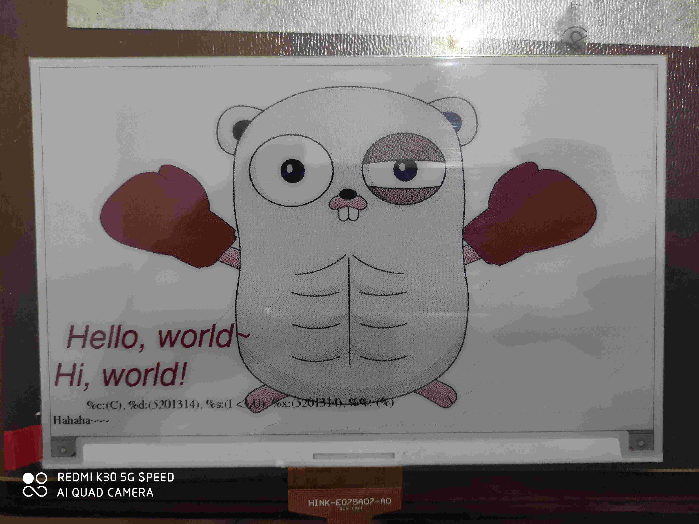

# EPD75BHD

An ESP32 Arduino library for [Waveshare 7.5 inch 3-color E-Paper Display (880x528)](https://www.waveshare.com/wiki/7.5inch_HD_e-Paper_HAT)

Demo:



## Features

- Developed in C++
- Work out of the box
- Initialize display in one line
- Support Adafruit GFX fonts
- Powerful formatted print function (`GFX::GFXPrintf`)
- Display [PPM image](http://netpbm.sourceforge.net/doc/ppm.html) from SD card

## Installation

- For Arduino IDE, download this repository as [a zip file](https://github.com/lirc572/EPD75BHD/archive/master.zip) and follow <https://www.arduino.cc/en/guide/libraries#toc4>
- For [PlatformIO IDE](https://platformio.org/):
  - Either clone this repository and copy the entire folder to your project's `/lib` folder
  - Or if your project uses Git, add this repository as a submodule under your project's `/lib` folder

## Important Notes

- This library is built for the Espressif ESP32 using the Arduino Framework, it has not been tested on other platforms
- This library uses at least *over 100KB RAM*, therefore it **CANNOT** be used for standard AVR based Arduino boards (which have only 2KB RAM)
- This library works perfectly on PlatformIO IDE (which is much more developer-friendly than the Arduino IDE)
- The methods whose name start with `GFX` only update the RAM, to reflect the change to the display, call the EPD class's `Display()` method
- About PPM functions:
  - `PPM2IMG` function requires a huge amount of RAM (> 2 bits per pixel) because it creates a new `Image` class, use it with caution, or your program may crash
  - `DrawPPM` function uses very little extra RAM because it skips the step of creating a `Image` class and directly make the changes on the EPD class's image buffers
  - The PPM format is not fully implemented, please adhere to the following rules:
    - First line: `P3`
    - Second line: `<width> <height>` (e.g. 880 528)
    - Third line: `1` (the maximum color value, since the display does not support grayscale)
    - Each pixel must be on its own line, with the format of `<R> <G> <B>`, each color takes the value of either `0` or `1`
    - A valid pixel line should be one of the following:
      - `1 1 1` (black)
      - `0 0 0` (white)
      - `1 0 0` (red)
  - Currently the PPM functions are relatively slow. E.g. when using `DrawPPM` with a picture of the same size as the display, it takes approximately 80 seconds to complete
  - **To convert your image to supported PPM format, use [this Python3 script](https://gist.github.com/lirc572/0fdbfd8610fab6bbfc02cbfdbb8b3077)**
- This library supports Adafruid GFX fonts. Create your own font headers at <https://rop.nl/truetype2gfx/>

## Get Started

Refer to the [examples](https://github.com/lirc572/EPD75BHD/tree/master/examples) in this repository.

## Basic Usage

Include the EPD class library:

```C++
#include <EPD75BHD.hpp>
```

Create a new EPD class and initialize the display:

```C++
EPD75BHD epd(<sck_pin>, <mosi_pin>, <cs_pin>, <rst_pin>, <dc_pin>, <busy_pin>);
epd.Init();
```

Clear the display (make the whole screen white):

```C++
epd.Clear();
```

Print `Hello, world!` in red:

```C++
epd.GFXSetCursor(20, 400); // The cursor is at the bottom left corner of the first character you print
epd.GFXSetColor(GFXColor::RED);
epd.GFXPrintf("Hello, world!");
```

Advanced usage of `GFX::GFXPrintf`:

```C++
epd.GFXPrintf("%%c:(%c), %%d:(%d), %%s:(%s), %%x:(%x), %%%%:(%%)\nHahaha~~~\n", 'C', 5201314, "I <3 U", 85988116);
/*
Result:
%c:(C), %d:(5201314), %s:(5201314), %x:(5201314), %%:(%)
Hahaha~~~
*/
```

Make the central pixel black:

```C++
epd.GFXSetPixel(epd.WIDTH/2, epd.HEIGHT/2, GFXColor::BLACK);
```

Draw a red rectangle at the center:

```C++
epd.GFXClearRect(100, 100, epd.WIDTH-100, epd.HEIGHT-100, GFXColor::RED);
```
Draw a 4x4 black point at the center:

```C++
epd.GFXDrawPoint(epd.WIDTH/2, epd.HEIGHT/2, GFXColor::BLACK, 4);
```

Load and draw a `PPM` image from SD card:

```C++
SDC* sd = new SDC(); //SD card wrapper class
if (!DrawPPM(*(sd->fs), "/test.ppm", epd, 0, 0)) { // read /test.ppm from SD card
    std::printf("Done drawing image!\n");
} else {
    std::printf("Read file failed...\n");
}
```

Commit the changes to the display:

```C++
epd.Display();
```

Put the display at deep-sleep mode:

```C++
epd.DeepSleep()
```

## Future Plan

- Screen rotation
- No-buffer solution
- Reduce time complexity
- Dithering for color images
- GUI framework